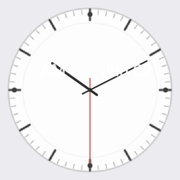
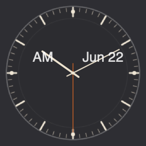
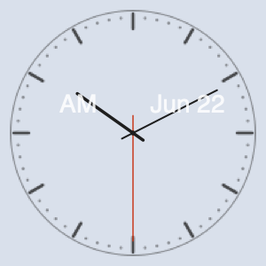
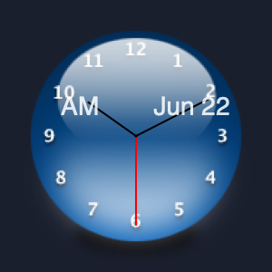
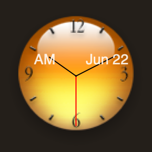
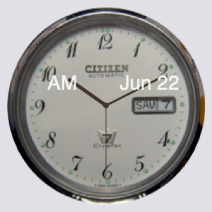
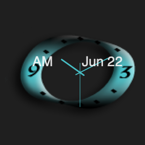
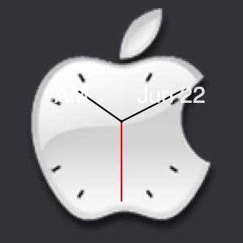

# Klok

A macOS menu-bar clock inspired by the classic Windows freeware **ClocX**. Displays an analog clock on the desktop using ClocX-compatible skin files, with a full-featured menu bar icon, calendar popover, and alarm system.

**[中文 README](README.md)**

## Preview

| KlokClassic | KlokDark | KlokOutline |
|:-----------:|:--------:|:-----------:|
|  |  |  |

> These are the three built-in originals. Download the skin pack to load hundreds of community skins — a few examples:

| Azul | BallClockAmber | Citizen |
|:----:|:--------------:|:-------:|
|  |  |  |

| WidestoneStudios | White Apple Clock |
|:----------------:|:-----------------:|
|  |  |

## Features

- Analog clock window using ClocX `.ini` + image skin format
- Supports both BMP (cut-color masking) and PNG (real alpha) skins
- PNG hand sprites (`HourPNG`, `MinutePNG`, `SecondPNG`)
- Menu bar icon with live time, configurable date format and icon styles
- Calendar popover with system calendar event integration
- Alarm / reminder system with notifications
- Multiple language support: 简体中文 / 繁體中文 / English
- Light & dark mode
- Requires macOS 13+

## ClocX Skin Compatibility

Klok reads the same `.ini` + image format used by the original Windows ClocX. You can use the thousands of skins accumulated by the ClocX community over the years.

### Where to get ClocX skins

**Pre-packaged skin pack (recommended)** — hundreds of curated community skins, ready to load:

- 👉 **[Lanzou Cloud](https://wwbjv.lanzout.com/i9rBb3skqt7e)**
- 👉 **[MEGA](https://mega.nz/file/nX5mkJrD#qZPrWY5O4_bG9VFpMVmzfolc1Lf38MjF2bWIOoWedco)**
- 👉 **[pCloud](https://u.pcloud.link/publink/show?code=XZ3L8N5ZsjtfUt1GnI8DjJGuapj8by77CFiV)**

Other sources:

- **ClocX official skin library**: [clockx.narod.ru](http://clockx.narod.ru/) — hundreds of officially listed skins
- **DeviantArt**: search [`ClocX skin`](https://www.deviantart.com/search?q=clockx+skin) — community-designed originals
- Various Windows software sharing forums: search "ClocX skins pack"

### Installing skins

1. Download and unzip `ClockX-Skins.zip` to any folder (e.g. `~/Documents/ClockX-Skins/`)
2. Open **Preferences → Appearance** and click **Browse…** to select that folder
3. The skin list refreshes immediately — click any skin to apply it

> Note: third-party skins are copyrighted by their respective creators. Please respect the author's license terms.

## Building

Requires Xcode Command Line Tools and Swift 5.9+.

```bash
# Debug run
swift run

# Build release .app bundle
./build_app.sh

# Build distributable .dmg
./build_dmg.sh
```

The `.app` is placed in `dist/Klok.app`.

## Project Structure

```
Sources/Klok/
  AppDelegate.swift                  — app lifecycle, menu bar icon, status menu
  ClockWindowController.swift        — borderless clock window, drag, right-click menu
  ClockView.swift                    — analog clock rendering (hands, overlays)
  ClocXSkin.swift                    — skin loader: INI parser, BGR color, hand sprites
  ImageSkinLoader.swift              — pure-image skin support (PNG without INI)
  CalendarPopover.swift              — calendar panel + event list
  PreferencesWindowController.swift  — skin picker, general, alarms tabs
  AlarmManager.swift                 — scheduling, UserNotifications
  Settings.swift                     — UserDefaults-backed settings store
  L10n.swift                         — localization strings (zh / zh-TW / en)
Skins/                               — bundled original skins (see licensing note)
Tools/
  generate_default_skins.swift       — script that generates the bundled skin PNGs
```

## Skin Licensing

The `Skins/` directory contains three original skins (`KlokClassic`, `KlokDark`, `KlokOutline`) created for this project and released under the MIT License.

Skins you add yourself are subject to their respective authors' terms. Do not redistribute third-party skins without permission.

## License

MIT — see [LICENSE](LICENSE).

This project is not affiliated with or endorsed by the original ClocX author or any brand whose name appears in community skin filenames.
