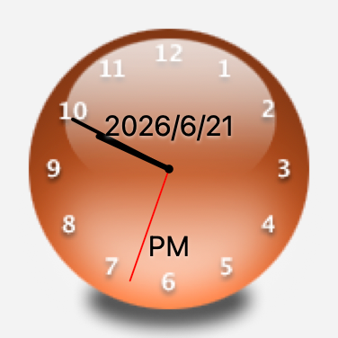

# Klok

macOS 菜单栏模拟时钟，仿照经典 Windows 工具 **ClocX** 设计。支持 ClocX 皮肤格式，带日历弹窗、提醒系统和多语言界面。

**[English README](README.en.md)**



## 功能特性

- 桌面模拟时钟，原生支持 ClocX `.ini` + 图片皮肤格式
- 同时支持 BMP（透明色抠图）和 PNG（真实 Alpha 通道）皮肤
- 支持 PNG 指针精灵图（`HourPNG` / `MinutePNG` / `SecondPNG`）
- 菜单栏时钟图标，支持实时时间、自定义日期格式和多种图标样式
- 日历弹窗，集成系统日历事件
- 提醒 / 闹钟系统，支持系统通知
- 多语言界面：简体中文 / 繁體中文 / English
- 支持亮色与深色模式
- 需要 macOS 13 或更高版本

## ClocX 皮肤兼容

Klok 完整兼容 ClocX 的皮肤格式（`.ini` 配置 + 表盘图片），可以直接使用多年来 ClocX 社区积累的海量皮肤资源。

### 安装皮肤

将皮肤文件夹（包含 `.png`/`.bmp` 和 `.ini` 文件）放入以下目录，重启 Klok 后在「设置 → 外观」中选择皮肤：

```
~/Library/Application Support/Klok/Skins/
```

也可以在偏好设置的外观标签页中直接浏览并选择皮肤。

### 获取 ClocX 皮肤

ClocX 的社区皮肤资源可以从以下渠道获取：

- **ClocX 官网皮肤库**：[clockx.narod.ru](http://clockx.narod.ru/) — 包含数百款官方收录皮肤
- **DeviantArt**：搜索 [`ClocX skin`](https://www.deviantart.com/search?q=clockx+skin) — 大量社区设计师的原创皮肤
- **各类 Windows 工具分享论坛**：搜索「ClocX 皮肤」或「ClocX skins pack」

> 注意：第三方皮肤版权归各自创作者所有，使用时请尊重原作者的许可条款。

## 构建方法

需要 Xcode 命令行工具（CLT）和 Swift 5.9+。

```bash
# 调试运行
swift run

# 构建 release .app 包
./build_app.sh

# 构建可分发的 .dmg
./build_dmg.sh
```

构建产物位于 `dist/Klok.app`。

## 项目结构

```
Sources/Klok/
  AppDelegate.swift              — 应用生命周期、菜单栏图标、状态菜单
  ClockWindowController.swift    — 无边框时钟窗口、拖动、右键菜单
  ClockView.swift                — 模拟时钟渲染（指针、文字叠层）
  ClocXSkin.swift                — 皮肤加载：INI 解析、BGR 颜色、指针精灵图
  ImageSkinLoader.swift          — 纯图片皮肤支持（无 INI 的 PNG）
  CalendarPopover.swift          — 日历面板 + 事件列表
  PreferencesWindowController.swift — 皮肤选择、通用设置、闹钟标签页
  AlarmManager.swift             — 闹钟调度、UserNotifications
  Settings.swift                 — 基于 UserDefaults 的设置存储
  L10n.swift                     — 多语言字符串（简中/繁中/日语/英语）
Skins/                           — 内置原创皮肤（详见下方授权说明）
Tools/
  generate_default_skins.swift   — 内置皮肤生成脚本
```

## 皮肤授权说明

`Skins/` 目录中包含三款原创皮肤（`KlokClassic`、`KlokDark`、`KlokOutline`），均为本项目自绘，以 MIT 协议发布。

用户自行添加的其他皮肤须遵守其原作者的版权条款，请勿在未获授权的情况下再分发。

本项目与 ClocX 原作者及任何皮肤文件名中涉及的品牌/商标均无关联。

## 开源协议

MIT — 详见 [LICENSE](LICENSE)

---

*Klok 与 ClocX 原作者及任何品牌商标均无隶属或背书关系。*
